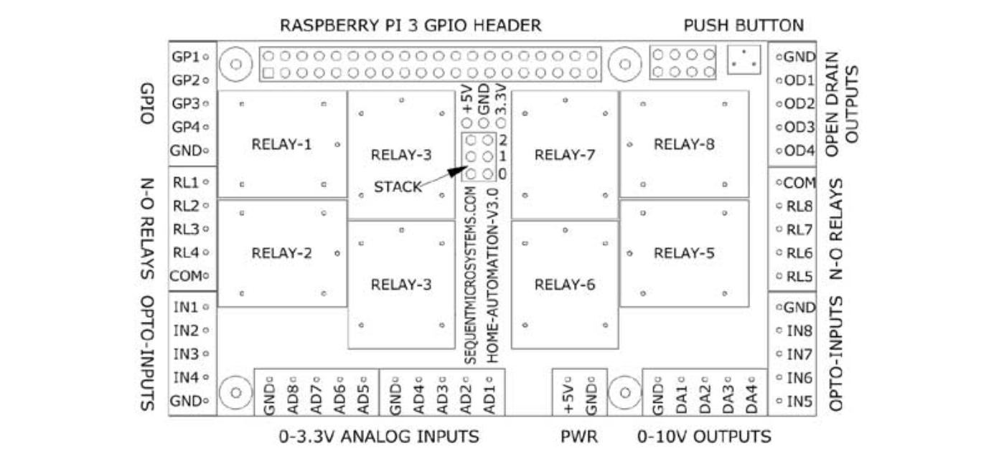

[]

# ioplus-rpi

Command Line, Python, and Node-Red for [Home Automation Stackable Card for Raspberry Pi](https://sequentmicrosystems.com/products/raspberry-pi-home-automation-card)




## Setup

Enable Raspberry Pi I2C communication by opening a terminal and typing:
```bash
~$ sudo raspi-config
```
Go to the *Interface Options* menu then *I2C* and enable the port.

## Install ioplus

```bash
~$ cd ioplus-rpi/
~/ioplus-rpi$ sudo make install
```

Now you can access all the functions of the relays board through the command "ioplus". Use -h option for help:
```bash
~$ ioplus -h
```

## Important commands

    Usage:		ioplus -v
	Usage:		ioplus -h    Display command options list
	Usage:		ioplus -h <param>   Display help for <param> command option
	Usage:		ioplus -pinout	Display the board io connector pinout
	Usage:		ioplus -list	List all ioplus boards connected,return the # of boards and stack level for every board
	Usage:		ioplus <stack> board
	Usage:		ioplus <stack> relwr <channel> <on/off>
	Usage:		ioplus <stack> relrd <channel>
	Usage:		ioplus <stack> reltest
	Usage:		ioplus <stack> gpiowr <channel> <on/off>
	Usage:		ioplus <stack> gpiord <channel>
	Usage:		ioplus <stack> gpiodirwr <channel> <out/in> 
	Usage:		ioplus <stack> gpiodirrd <pin>
	Usage:		ioplus <stack> gpioedgewr <channel> <edges> 
	Usage:		ioplus <stack> gpioedgerd <pin>
	Usage:		ioplus <stack> gpiocntrd <channel>
	Usage:		ioplus <stack> gpiocntrst <channel>
	Usage:		ioplus <stack> optrd <channel>
	Usage:		ioplus <stack> odrd <channel>
	Usage:		ioplus <stack> odwr <channel> <value>
	Usage:		ioplus <stack> dacrd <channel>
	Usage:		ioplus <stack> dacwr <channel> <value>
	Usage:		ioplus <stack> adcrd <channel>
	Usage:		ioplus <stack> adccal <channel> <value>
	Usage:		ioplus <stack> adccalrst <channel>
	Usage:		ioplus <stack> daccal <channel> <value>
	Usage:		ioplus <stack> daccalrst <channel>
	Usage:		ioplus <stack> wdtr
	Usage:		ioplus <stack> wdtpwr <val> 
	Usage:		ioplus <stack> wdtprd 
	Usage:		ioplus <stack> wdtipwr <val> 
	Usage:		ioplus <stack> wdtiprd 
	Usage:		ioplus <stack> wdtopwr <val> 
	Usage:		ioplus <stack> wdtoprd 
	Usage:		ioplus <stack> iotest
	Usage:		ioplus <stack> iotest <test type>
	Usage:		ioplus <stack> pwmfrd
	Usage:		ioplus <stack> pwmfwr <value>


## Command details

	board		Display the board status and firmware version number
	relwr:		Set relays On/Off
	relrd:		Read relays status
	reltest:	Turn ON and OFF the relays until press a key
	gpiowr:		Set gpio pins On/Off
	gpiord:		Read gpio status
	gpiodirwr:	Set gpio pins direction I/O  0- output; 1-input
	gpiodirrd:	Read gpio direction 0 - output; 1 - input
	gpioedgewr:	Set gpio pin counting edges  0- count disable; 1-count rising edges; 2 - count falling edges; 3 - count both edges
	gpioEdgerd:	Read gpio counting edges 0 - none; 1 - rising; 2 - falling; 3 - both
	gpiocntrd:	Read gpio edges count for one GPIO imput pin
	gpiocntrst:	Reset gpio edges count for one GPIO imput pin
	optrd:		Read optocoupled inputs status
	odrd:		Read open drain output pwm value (0% - 100%)
	odwr:		Write open drain output pwm value (0% - 100%), Warning: This function change the output of the coresponded DAC channel
	dacrd:		Read DAC voltage value (0 - 10V)
	dacwr:		Write DAC output voltage value (0..10V), Warning: This function change the output of the coresponded open-drain channel
	adcrd:		Read ADC input voltage value (0 - 3.3V)
	adccal:		Calibrate one ADC channel, the calibration must be done in 2 points at min 2V apart
	adccalrst:	Reset the calibration for one ADC channel
	daccal:		Calibrate one DAC channel, the calibration must be done in 2 points at min 5V apart
	daccalrst:	Reset calibration for one DAC channel
	wdtr:		Reload the watchdog timer and enable the watchdog if is disabled
	wdtpwr:		Set the watchdog period in seconds, reload command must be issue in this interval to prevent Raspberry Pi power off
	wdtprd:		Get the watchdog period in seconds, reload command must be issue in this interval to prevent Raspberry Pi power off
	wdtipwr:	Set the watchdog initial period in seconds, This period is loaded after power cycle, giving Raspberry time to boot
	wdtiprd:	Get the watchdog initial period in seconds. This period is loaded after power cycle, giving Raspberry time to boot
	wdtopwr:	Set the watchdog off period in seconds (max 48 days), This is the time that watchdog mantain Raspberry turned off 
	wdtoprd:	Get the watchdog off period in seconds (max 48 days), This is the time that watchdog mantain Raspberry turned off 
	iotest:		Test the ioplus with loopback card inserted 
	pwmfrd:		Read open-drain pwm frequency in Hz 
	pwmfwr:		Write open dran output pwm frequency in Hz [10..64000]
